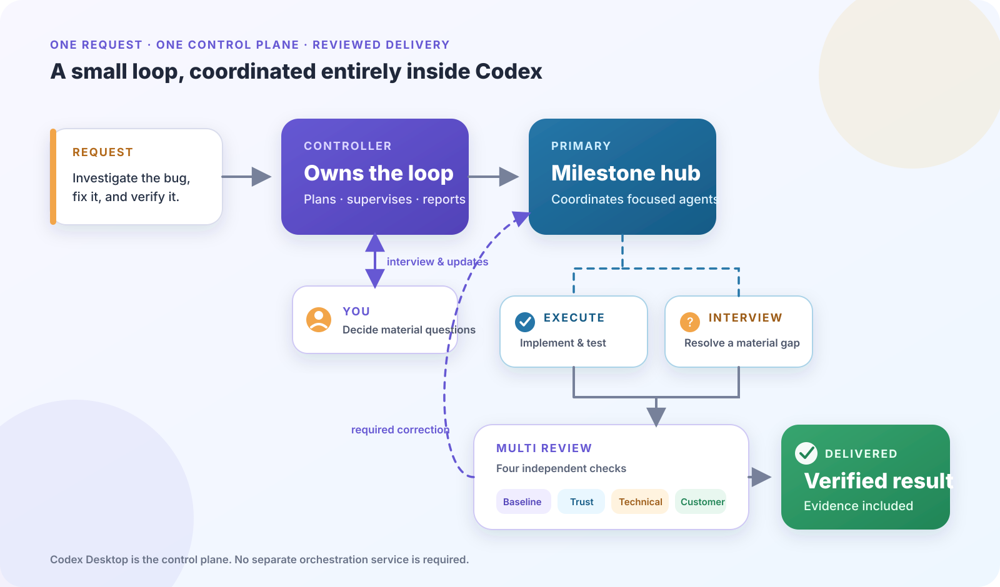

# Codex Small Loop

**The simplest loop-engineering environment for Codex.**


Codex Small Loop turns one software request into a long-running, reviewed,
multi-agent implementation inside Codex Desktop. Codex plans the work, divides
it between focused agents, checks the result from four perspectives, applies
necessary corrections, and returns verified evidence—without a separate
orchestrator, workflow server, database, or hosted dashboard.

> **Example request**
>
> Use Codex Small Loop to investigate the flaky checkout test, fix its root
> cause, run the full test suite, and verify the behavior in the browser.



## Why use it?

- **One explicit entry point.** Select Codex Small Loop in the composer, or ask
  Codex to use it. The plugin interviews you and proposes the implementation
  plan before changing the project.
- **Long-running ownership.** Controller keeps the complete job moving across
  milestones, handles recovery, and reports important boundaries to you.
- **Focused implementation.** Each milestone gets a Primary that coordinates
  Execute and Interview tasks without making you manage the internal agents.
- **Built-in multi-review.** Baseline, Trust, Technical Excellence, and Customer
  Value reviews check the same candidate before delivery.
- **A local, inspectable loop.** Coordination stays in Codex tasks,
  conversations, repository files, and bounded local runtime state.

## Quick start

### Requirements

| Platform | Requirements |
| --- | --- |
| macOS | Codex Desktop, Node.js 24 or newer, and Git |
| Windows | Codex Desktop, Node.js 24 or newer, Git, and the signed standalone Codex CLI |

Register this repository as a Codex plugin marketplace and install the plugin:

```sh
codex plugin marketplace add game-dev-rta-club/codex-small-loop
codex plugin add codex-small-loop@codex-small-loop
```

Open a new Codex conversation in the project you want to change. Then either:

- select **Codex Small Loop** from the Desktop **+** menu; or
- begin the request with **Use Codex Small Loop to ...**

That is the complete activation step. Codex Small Loop asks only for material
decisions, agrees on a plan with you, and then manages the implementation loop.

## How the loop works

1. **Controller talks with you.** It clarifies the outcome, agrees on a plan,
   divides large work into milestones, supervises progress, and reports results.
2. **Primary owns one milestone.** It is the hub for the implementation context
   and keeps its Execute, Interview, correction, and Review work together.
3. **Execute changes the project.** Interview is used when a material product or
   technical gap must be resolved before proceeding.
4. **Four Reviews inspect one fixed candidate.** Required findings return to the
   same milestone for correction; optional ideas do not automatically widen the
   implementation.
5. **Controller verifies delivery.** A milestone advances only after its evidence
   is complete. The overall request ends with a verified result or a clear user
   decision boundary.

This structure uses Codex itself as the control plane. There is no additional
agent framework to deploy and no external service that must remain running.

## Inspect progress locally

Codex Small Loop includes a local **Board** with two views:

- **Activity** shows retained Primary milestones, their agents, Turn timeline,
  confirmed output, and Review cycles.
- **Sonner** shows the project Work Graph, a bounded Files index, and a small
  active-task Runtime health view.

Agents can read the same project projection as deterministic text:

```sh
node <plugin-root>/components/commands/sonner.mjs --project-root "$PWD"
```

Add `--json` for the canonical machine-readable schema used by the local API.

## Platform support

Codex Small Loop supports Codex Desktop on macOS and Windows. The coordination
model and Board are shared across both platforms. Platform-specific readers are
bounded separately; opening a selected file or Work folder is currently
macOS-only.

## Experimental status

Codex Small Loop is an experimental pre-1.0 project. It is intended for people
who want to evaluate loop engineering on real repository work. Long-running
multi-agent tasks use more time and tokens than an ordinary Codex turn, and the
project has not yet reached production-grade stability. Review the agreed plan
and tool permissions before allowing changes to important repositories.

## Documentation

- [Installation](user-documentation/install.md)
- [Run a Task](user-documentation/run-a-task.md)
- [Project overview](overview/overview.md)
- [Work Graph concept](specification/system-specification/work-graph/concept.md)
- [Implementation and testing](implementation/testing.md)
